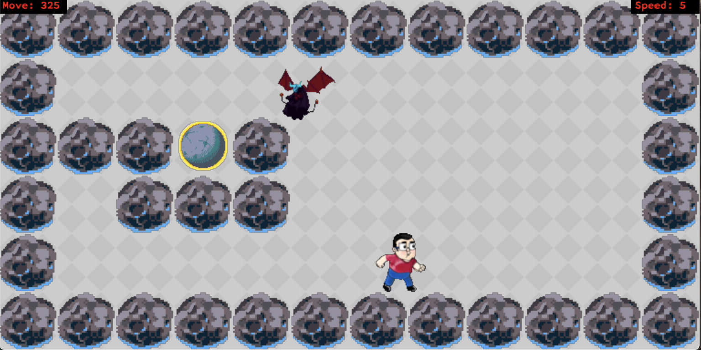

# **SO_LONG**

This project's goal is to develope yourself on MLX library and to have some experiences about windowed projects (puting image, puting pixel, opening a new window, closing a window and so on) by creating a 2D game.

## There are some sample pictures about my project(Game).
|||
|:-:|:-:|
|||
|||
|||

## MLX Library

Mlx is a basic library to open a window. It has a lot of functions. I'll try to explain them and give some important details.

### Fuctions
```c
void  *mlx_init();
```
<!--  This function initilazies-->

```c
void  *mlx_new_window(void *mlx_ptr, int size_x, int size_y, char *title);
```
```c
int   mlx_clear_window(void *mlx_ptr, void *win_ptr);
```
```c
int   mlx_destroy_window(void *mlx_ptr, void *win_ptr);
```
```c
int   mlx_pixel_put(void *mlx_ptr, void *win_ptr, int x, int y, int color);
```
```c
int   mlx_string_put(void *mlx_ptr, void *win_ptr, int x, int y, int color, char *string);
```
```c
void  *mlx_xpm_file_to_image(void *mlx_ptr, char *filename, int *width, int *height);
```
```c
int   mlx_put_image_to_window(void *mlx_ptr, void *win_ptr, void *img_ptr, int x, int y);
```
```c
int   mlx_destroy_image(void *mlx_ptr, void *img_ptr);
```
